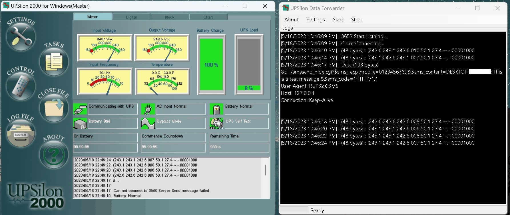
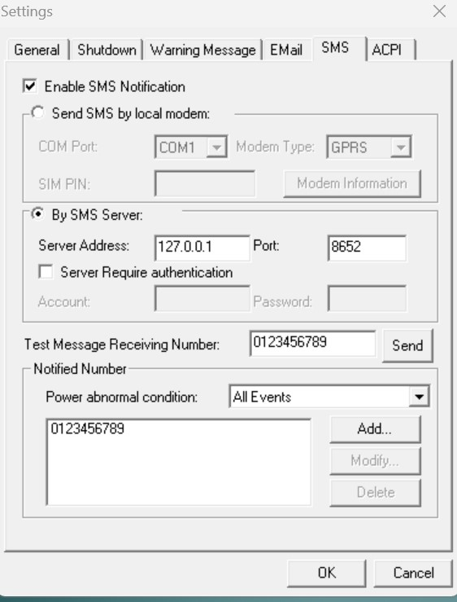
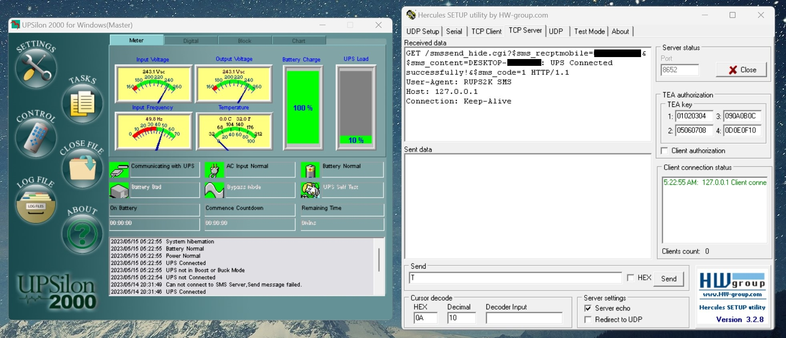
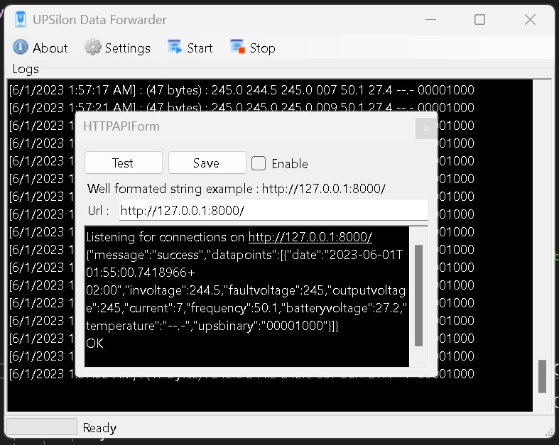
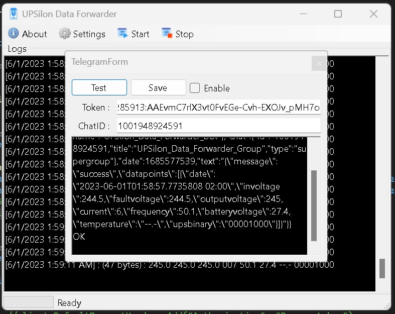
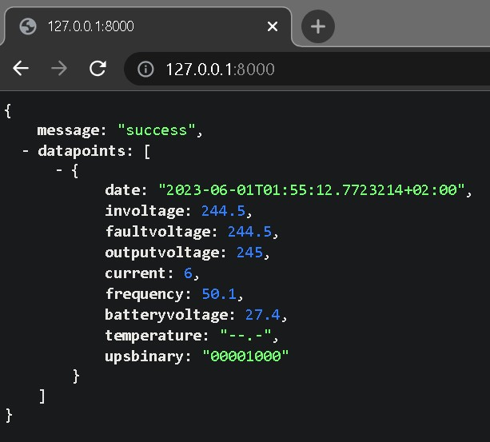

# UPSilon Data Forwarder

Check out my short article [here](https://tutorials.techrad.co.za/2023/05/17/upsilon-remote-monitor "My tutorials site").

Choose SMS to grab data from the port it's sent to

A C# application which forwards the strings and alerts from a single phase generic UPS using UPSilon 2000 software.

The application listens on the ports `XX` and `XX` and forwards this UPS status data stream to an endpoint of your choice.

In the example application I have two options: `Telegram` and an `HTTP API` endpoint.

The communication protocol parsed is the `MEGAPRO7.DOC` created by `Kevin Chiou`

UPS status data stream `(MMM.M NNN.N PPP.P QQQ RR.R S.SS TT.T b7b6b5b4b3b2b1b0<cr>`

### UPS status data stream :

- There should be a space character between every field for data separation. The meaning of each field is list as followed:
  - a. Start byte : `(`
  - b.I/P voltage : `MMM.M`
  - M is and integer number ranging from `0 to 9`. The unit is Volt.
  - c.I/P fault voltage : `NNN.N`
  - N is and integer number ranging from `0 to 9`.The unit is Volt.
  - d.O/P voltage : `PPP.P`
  - P is an integer number ranging form `0 to 9`.The unit is Volt.
  - e.O/P current : `QQQ`
  - `QQQ` is a percent of maximum current, not an absolute value.
  - f.I/P frequency : `RR.R`
  - R is an integer number ranging from `0 to 9`.The unit is HZ.
  - g.Battery voltage : `SS.S` or `S.SS`
  - S is an integer number ranging from `0 to 9`.
  - h.Temperature : `TT.T`
  - T is an integer number ranging form `0 to 9`. The unit is degree of centigrade.

### ** For OFF LINE UPS**
Its purpose is to identify a short duration voltage glitch
which cause OFF line UPS to go to Invter mode.
 If this occurs
input voltage will appear normal at query prior to glitch and
will still appear normal at next query.

The I/P fault voltage will hold glitch voltage till next
query. After query, the I/P fault voltage will be same as I/P
voltage until next glitch occurs.

### ** For ON LINE UPS**
Its purpose is to identify a short duration utility fail
which cause ON line UPS to go to battery mode.
 If this occurs
input voltage will appear normal at query prior to fail and
will still appear normal at next query.

The I/P fault voltage will hold utility fail voltage till
next query. After query, the I/P voltage will be same as I/P
voltage until next utility fail occurs.

For on-line units battery voltage/cell is provided in the
form S.SS .

For standby units actual battery voltage is provided in
the form SS.S .

UPS type in UPS status will determine which reading was
obtained.

### i.UPS Status : <U>
<U> is one byte of binary information such as
<b7b6b5b4b3b2b1b0>.
Where bn is a ASCII character ‘0’ or ‘1’.

|Bit|Description|
| :------------| :------------ |
|7|1 : Utility Fail (Immediate)|
|6|1 : Battery Low|
|5|1 : Bypass/Boost or Buck Active|
|4|1 : UPS Failed|
|3|1 : UPS Type is Standby (0 is On_line)|
|2|1 : Test in Progress|
|1|1 : Shutdown Active|
|0|1 : Beeper On|

---

